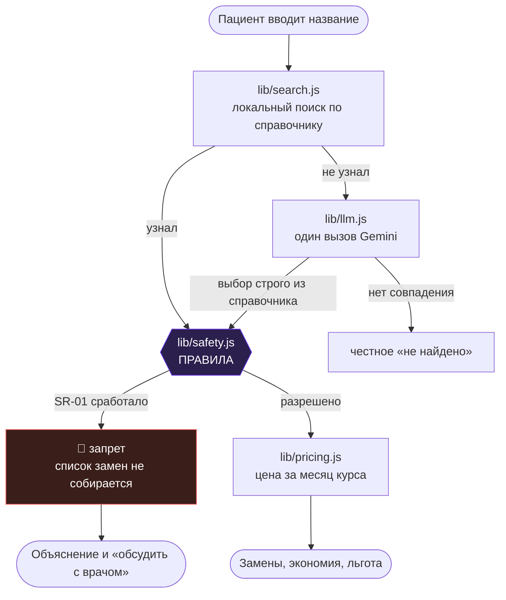

<div align="center">

# 💊 АНАЛОГ

**Тот же препарат дешевле — и честное «нельзя», когда заменять опасно.**

[](https://github.com/BAITC-Hacks/hack-4678e26f-teras)
[](#-проблема)
[](#-стек)
[](#-быстрый-старт)
[](LICENSE)

[Демо](#-демо) · [Быстрый старт](#-быстрый-старт) · [Архитектура](#-архитектура) · [Безопасность](#-безопасность-и-границы) · [Команда](#-команда)

</div>

---

## 📌 Проблема

> Пациенту с хроническим назначением выписывают препарат по торговому наименованию. О том, что у того же действующего вещества есть зарегистрированные аналоги дешевле в два-три раза, он не знает — в рецепте одно название, в аптеке предлагают его же.

- **Переплата вслепую** — пациент платит вдвое больше, не зная, что выбор есть.
- **Брошенная терапия** — столкнувшись с ценой месячного курса, человек перестаёт лечиться и возвращается в систему уже с обострением.
- **Неполученная льгота** — часть пациентов платит за то, что положено им бесплатно при подтверждённом диагнозе.
- **Опасная самодеятельность** — те, кто всё-таки ищет замену сам, не знают, что для части препаратов она недопустима без врача.

**Почему это здравоохранение, а не поиск по ценам.** Целевой результат — не экономия, а **приверженность терапии**: пациент, который может позволить себе курс, его допивает. Поэтому продукт умеет отказывать, отделяет правила от модели и говорит о праве на бесплатное получение раньше, чем о скидке.

## 💡 Решение

АНАЛОГ — это справочный сервис, который по названию с упаковки находит взаимозаменяемые препараты и **проверяет допустимость замены правилами**, чтобы пациент экономил там, где это безопасно, и шёл к врачу там, где нет.

| | Было | Стало с АНАЛОГОМ |
|---|---|---|
| Узнать про аналоги | обойти аптеки или спросить врача на приёме | 5 секунд, с телефона у витрины |
| Месяц приёма пантопразола | 4 500 ₸ (Нольпаза) | 1 554 ₸ (Пептазол), −66 % |
| Знание о льготе | случайность | показано до цен |
| Риск опасной замены | на совести пациента | замена запрещена правилом |

## ✨ Возможности

- 🔍 **Поиск, устойчивый к человеку** — опечатки, латиница, отсутствие дозировки. Девять запросов из десяти обслуживает локальный справочник, без сети и без модели.
- 🛑 **Запрет вместо совета** — для препаратов узкого терапевтического диапазона список замен не собирается вовсе. Правило выполняет код, не модель.
- 🟢 **Отметка о льготе** — если препарат положен бесплатно, об этом сказано раньше, чем о цене.
- 💰 **Цена за курс, а не за упаковку** — пачка на 100 таблеток дороже пачки на 28, но месяц приёма дешевле. Сравнивать можно только курс.
- 🔌 **Работает без API-ключа** — демо-режим включён по умолчанию, проверяющему не нужны ваши секреты.

## 🎬 Демо

<div align="center">

<!-- заменить на запись основного сценария: docs/demo.gif -->


**Живой стенд:** _вставить ссылку_ · **Видео:** _вставить ссылку_

</div>

> ⏱ Первая загрузка спящего стенда занимает около 30 секунд — бесплатный инстанс Render засыпает после 15 минут простоя. Дальше всё мгновенно.

Четыре запроса показывают продукт целиком. Они вынесены кнопками под полем ввода — печатать ничего не нужно.

| Запрос | Что происходит |
|---|---|
| `Нольпаза 40` | Пантопразол, пять взаимозаменяемых препаратов, экономия ≈ 2 900 ₸ в месяц |
| `Эутирокс 50` | 🛑 **Замена запрещена.** Левотироксин — узкий терапевтический диапазон. Цен на экране нет |
| `Лизиноприл 10` | Замены плюс отметка: положен бесплатно при подтверждённом диагнозе |
| `Глюкофаж Лонг 750` | Пролонгированная форма: обычный метформин в список не попадает, и об этом сказано |

Границы продукта: `от головы что-нибудь` — препарат по симптому не подбирается.

## 🏗 Архитектура



<details>
<summary><b>Почему так</b></summary>

- **Локальный поиск стоит перед моделью, а не после.** Девять запросов из десяти закрывает справочник — мгновенно, без сети и без расхода квоты бесплатного тарифа. Продукт остаётся работоспособным при полностью недоступном внешнем API.
- **Правила выполняются до обращения к модели и независимо от неё.** Модель не участвует в решении о допустимости замены и не может снять запрет.
- **Справочник лежит файлами в репозитории.** Проверяющий получает данные вместе с кодом: ни базы, ни регистрации во внешних сервисах.
- **Никакой сборки.** Один `server.js` и один `index.html` — меньше шагов между `git clone` и работающим экраном.

</details>

## 🧰 Стек

| Слой | Технологии |
|---|---|
| Сервер | Node 20+, Express |
| Клиент | Ванильный JS, без сборки |
| Данные | JSON-файлы в `data/` |
| ML / AI | Gemini Flash через REST, только как запасной путь поиска |
| Инфра | Render (`render.yaml`), smoke-тест на голом `fetch` |

Внешняя зависимость ровно одна — Express.

## ⚡ Быстрый старт

**API-ключ не нужен.** Демо-режим включён по умолчанию: вместо обращений к модели проигрываются записанные ответы, а поиск по справочнику от модели не зависит вовсе.

```bash
git clone https://github.com/BAITC-Hacks/hack-4678e26f-teras.git
cd hack-4678e26f-teras
npm install
npm start
```

Откроется на http://localhost:3000

```bash
npm run smoke     # семь сценариев из спецификации
```

<details>
<summary><b>Проверить боевой стенд и разбудить его перед показом</b></summary>

```bash
BASE_URL=https://ваш-сервис.onrender.com npm run smoke
BASE_URL=https://ваш-сервис.onrender.com npm run wake
```

Тот же файл гоняется локально и по бою — иначе «работает у меня» и «работает у жюри» остаются разными утверждениями.

</details>

<details>
<summary><b>Запуск с живой моделью</b></summary>

```bash
cp .env.example .env
# GEMINI_API_KEY=...
# DEMO_MODE=0
npm start
```

</details>

## 🔑 Конфигурация

| Переменная | Описание | По умолчанию |
|---|---|---|
| `DEMO_MODE` | `1` — записанные ответы модели, ключ не нужен | `1` |
| `GEMINI_API_KEY` | Ключ Google AI Studio. Нужен только при `DEMO_MODE=0` | — |
| `GEMINI_MODEL` | Идентификатор модели | `gemini-2.0-flash` |
| `PORT` | Порт приложения | `3000` |

## 📡 API

<details>
<summary><b>Основные эндпоинты</b></summary>

| Метод | Путь | Описание |
|---|---|---|
| `GET` | `/api/health` | Состояние, режим, коммит, размер справочника |
| `POST` | `/api/search` | Свободный ввод → позиции справочника |
| `GET` | `/api/drug/:id` | Карточка препарата |
| `GET` | `/api/alternatives/:id` | Замены, правила, льгота |

```bash
curl -X POST http://localhost:3000/api/search \
  -H "Content-Type: application/json" \
  -d '{"query": "нолпаза 40"}'

curl http://localhost:3000/api/alternatives/euthyrox-50-100
```

Второй запрос возвращает `blocked.code = "SR-01"` и **пустой** массив `alternatives`: запрет живёт на сервере, а не в разметке.

</details>

## 🛡 Безопасность и границы

Система **не назначает лечение, не отменяет назначения врача и не является аптекой**. Она показывает справочную информацию о зарегистрированных препаратах с одинаковым действующим веществом. Решение о замене принимает врач или фармацевт.

### Правила, которые выполняет код, а не модель

| Код | Условие | Действие |
|---|---|---|
| `SR-01` | Узкий терапевтический диапазон: левотироксин, варфарин, дигоксин, литий, фенитоин, карбамазепин, циклоспорин, такролимус, теофиллин | 🛑 **Запрет.** Список замен не собирается |
| `SR-02` | Рецептурный отпуск | ⚠️ Замены справочно, с пометкой о рецепте |
| `SR-03` | Другая лекарственная форма, включая пролонгированную | Исключение из списка |

**Что будет, если модель ошибётся.** В худшем случае пользователь увидит лишнее предупреждение или «не найдено» вместо препарата. Ошибка в сторону опасного совета конструктивно невозможна: при срабатывании `SR-01` сервер отдаёт пустой массив, и интерфейс физически не может показать замены.

### О данных

Цены — **вручную собранный снимок**, а не выгрузка из официального источника и не остатки аптек. Дата снимка лежит в `data/snapshot.json` и показывается рядом с ценами. Персональные данные не собираются: на сервер уходит только название препарата.

> ⚠️ В текущей версии `snapshot.json` помечен как `ЧЕРНОВИК` — цены ориентировочные, поставлены при разработке. Заменить на собранные из открытых прайсов до демонстрации.

## 🗺 Roadmap

- [x] MVP: поиск, замены, правила безопасности, льгота
- [x] Работа без API-ключа, smoke-тест по боевому URL
- [ ] Живые прайсы и остатки вместо снимка
- [ ] Справочник на государственном реестре лекарственных средств
- [ ] Казахский язык
- [ ] Распознавание упаковки по фотографии
- [ ] Проверка дублирования вещества по списку препаратов пациента
- [ ] Подсказка врачу в момент выписки рецепта

**Чего не хватает для реальной эксплуатации.** Перечень препаратов узкого терапевтического диапазона и перечень льготного обеспечения требуют проверки практикующими врачами и фармацевтами. До этого продукт остаётся справочным инструментом, а не основанием для решений.

## 📂 Структура

```
.
├── server.js              три маршрута и /api/health
├── lib/
│   ├── catalog.js         загрузка справочника
│   ├── search.js          локальный поиск: синонимы, опечатки, дозировка
│   ├── safety.js          ЯДРО: правила допустимости замены
│   ├── pricing.js         пересчёт цены упаковки на месяц приёма
│   ├── llm.js             единственная точка обращения к модели
│   └── fixtures.js        записанные ответы для демо-режима
├── data/                  8 веществ, 35 наименований, дата снимка
├── public/index.html      один экран, три состояния
├── scripts/smoke.js       семь сценариев, локально и по бою
├── docs/                  демо, скриншоты, слайды
└── PROGRESS.md            почасовой журнал (п. 6.6 положения)
```

## 🧾 Предварительные наработки

Раскрываем в соответствии с п. 6.4 положения.

- Скелет приложения взят из собственного шаблона `hackathon-template`, подготовленного до хакатона: Express, `/api/health`, механика демо-режима, smoke-тест, скрипт пробуждения инстанса.
- Справочник препаратов собран до начала соревновательной части.
- Сторонние зависимости: `express`. Шрифты — Google Fonts.

## 👥 Команда

| | Участник | Роль |
|---|---|---|
|  | [@logreus-cloud](https://github.com/logreus-cloud) | Сервер, правила, справочник |
| | @teammate | Интерфейс, деплой, данные |

## 📄 Лицензия

MIT — см. [LICENSE](LICENSE).

---

<div align="center">
Сделано на хакатоне <b>BAITC Hacks</b> ❤️
</div>
